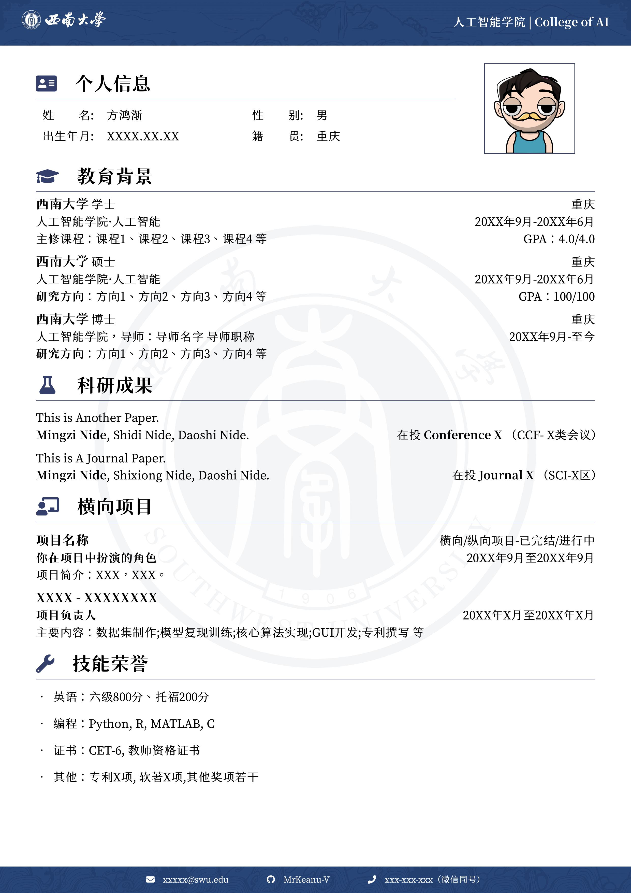
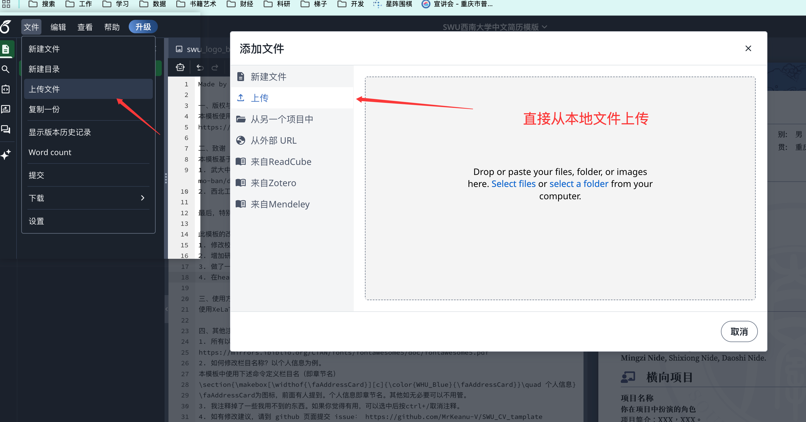

# SWU_CV_tamplate
这是一份基于西南大学视觉形象识别系统制作的LaTeX通用模版，欢迎大家使用！对您有帮助的话，可以给个star嗷~٩(๑òωó๑)۶

## 设计理念

结合缙云山、嘉陵江、玉兰花等元素，结合SWU VIS设计了背景、页眉、页脚等素材，并提供深色浅色两套素材主题。

**特别感谢Ela在素材设计和制作等方面提供的帮助🤟**

## 页面预览

浅色主题：

## 如何使用

### 如何在Overleaf使用本模板

以下是如何讲资源导入到Overleaf并使用
1. 直接下载本仓库，然后导入到Overleaf
2. 直接通过链接方式导入到Overleaf

如图，

~~直接在Overleaf中搜索“西南大学中文简历模版”并导入使用~~（Over Leaf似乎不怎么审核新模板，若以后本模板被Overleaf收纳，会及时更新README）

### 如何本地使用当前模板

本地使用需要配置Latex编译环境，可以使用PdfTex、XeLaTeX等编译器。Clone本仓库后直接运行即可。

P.S. 个人建议直接在Overleaf中导入本仓库链接，最直观和迅速

## 相关链接

GitHub：https://github.com/MrKeanu-V/SWU_CV_tamplate

Overleaf：（已上传，等待更新）

## 其他

目前已完善页眉、页脚和背景。

如有修改建议或使用问题，可以直接提Issue。对您有帮助的话，可以给个star嗷~٩(๑òωó๑)۶

最后，祝学弟学妹们学业工作顺利💪
